```{r setup, include=FALSE}
knitr::opts_chunk$set(echo = TRUE, warning = F, message = F)
```


# Introduction {.label:s-intro}

La qualité de vie est influencée par de nombreux facteurs, comme par exemple les facteurs économiques, la répartition démographique et les services publics. Quand on évalue le bien-être d'une population, on pourrait penser qu'un revenu moyen élevé garantit de meilleures conditions de vie. Cependant cette corrélation n'est pas évidente : certains départements riches peuvent être confrontés à des problématiques telles que des coûts de logements élevés, ou une forte densité de population, tandis que d'autres, avec des revenus plus bas, peuvent s’offrir un cadre de vie plus équilibré. Dès lors, nous pouvons nous poser les questions suivantes : 
\bigskip

\begin{center}

\textbf{Les départements français offrants les meilleures conditions de vie sont-ils nécessairement ceux avec les revenus moyens les plus élevés?  Et ces départements se démarquent-ils du lot avec des infrastructures culturelles plus nombreuses et avec moins de logements sociaux?
}

\end{center}
\medskip 

\justifying

Ces questions nous aident à comprendre les dynamiques entre revenu, salaire, logement sociaux, nombre d'établissements culturels (cinéma, théâtre, musée, etc) et bien-être social. En répondant à cette problématique, nous pourrons identifier les critères qui définissent une bonne qualité de vie. Comprendre ces dynamiques peut être utile aux citoyens pour faire des choix de résidences plus conscientes, aux politiques d'investissement et aménagement pour mieux s'orienter. Cette analyse pourrait ainsi favoriser un développement territorial plus équilibré et sensibiliser aux déterminants de la qualité de vie. En croisant les données économiques et sociales, cette étude propose une lecture plus nuancée des disparités sociales en France.

## Responsabilités et composition de l’équipe

\medskip
Kardiatou BA: Étudiant n° 22310777, Responsable de la collecte, manipulation des données, rapport et de la partie base de données.

\medskip
Lea CARMINATI Étudiant n° 22307644, Responsable gestion rapport, de la partie analyse exploratoire des données et tests.

\medskip
Diella Joannie GATEKA : Étudiant n° 22311183, Responsable de la collecte, manipulation des données, rapport et de la partie base de données.


\medskip
Lana SCHEMBRI:  Étudiant n° 22313116, Responsable rapport de la partie analyse exploratoire des données.

# Base de données

## Provenance des données
Voici les sources de données utilisées pour notre travail:

**Source de données 1**:

\tiny
\texttt{\url{https://www.data.gouv.fr/fr/datasets/limpot-sur-le-revenu-par-collectivite-territoriale-ircom/}} 
\normalsize
(format xlsx,12 colonnes et 1897 lignes).


Ce premier jeu de données fournit des informations sur les revenus des personnes vivant en France, réparties par département, sur la période de 2000 à 2017.

\bigskip

**Source de données 2**:

\tiny
\texttt{\url{https://www.data.gouv.fr/fr/datasets/logements-et-logements-sociaux-dans-les-departements-1/}}
\normalsize
(format csv, 34 colonnes et 601 lignes).

Ce deuxième jeu de données permet d’analyser l’évolution des territoires, l’activité de la construction et le secteur du logement social. Il comprend également  plusieurs indicateurs utiles pour évaluer la qualité de vie dans les départements. 

\bigskip

**Source de données 3**:

\tiny
\texttt{\url{https://www.data.gouv.fr/fr/datasets/entreprises-nombre-detablissements-culturels-actifs-par-departement/}}
\normalsize
(format csv, 101 lignes et 5 colonnes).


Ce troisième jeu de données renseigne sur le nombre total d’établissements culturels présents dans chaque département depuis 2022. Il indique également, d’une part, le nombre d’établissements culturels construits en 2018, et d’autre part, la part que ces établissements représentent. 


\medskip

La population étudiée  correspond aux ménages français, répartis par département, avec une distinction entre salariés et retraités.
Les données permettent d'analyser les disparités économiques et sociales entre les territoires. Les revenus fournissent une vision des écarts financiers, tandis que le chômage, la pauvreté et les logements permettent d'évaluer la qualité de vie socio-économique.
Les unités statistiques sont les départements français. Ils offrent une échelle d'analyse pour comparer les dynamiques sociales et économiques du pays.


## Descriptif des tables

Voici les tables conservées après filtrage:

|     Nom colonne    |   Type  |              Signification             | Caractéristique |
|:------------------:|:-------:|:--------------------------------------:|:---------------:|
|      code_dep      | integer |            code departement            |   clé primaire  |
|       nom_dep      | varchar |             nom departement            |                 |
|     code_region    | integer |               code region              |  clé étrangère  |
|       nbr_hab      | integer |      nombre habitants  departement     |                 |
|       densite      |  double |     densite habitants  departement     |                 |
|    pourcpopvingt   |  double |      pourcentage population 20 ans     |                 |
|   pourpopsoixante  |  double |      pourcentage population 60 ans     |                 |
|    taux_chomage    |  double |       taux de chômage departement      |                 |
|    taux_pauvrete   |  double |        taux pauvrete departement       |                 |
|  nbr_foyer_salarie | integer | nombre des foyers salariés departement |                 |
|  montant_salairie  |  double |          montant des salaires          |                 |
| nbr_foyer_retraite | integer |       nombre des foyers retraités      |                 |
|  montant_retraite  |  double |          montant des retraites         |                 |

Table: Departement (101 $\times$ 13)

| Nom colonne |   Type  | Signification | Caractéristique |
|:-----------:|:-------:|:-------------:|:---------------:|
| code_region | integer |  code region  |   clé primaire  |
| nom_region  | varchar | nom region    | unique          |

Table: Region (18 $\times$ 2)

|  Nom colonne |   Type  |              Signification              | Caractéristique |
|:------------:|:-------:|:---------------------------------------:|:---------------:|
|    id_eta    | integer |        identifiant etablissement        |   clé primaire  |
|   code_dep   | integer |             code departement            |  clé étrangère  |
|   nbr_t_eta  | integer |  nombre total établissements culturels  |                 |
| nbr_eta_2018 | integer | nombre établissements construit en 2018 |                 |

Table: Etablissement (101 $\times$ 4)
\medskip

|    Nom colonne   |   Type  |          Signification         | Caractéristique |
|:----------------:|:-------:|:------------------------------:|:---------------:|
|      id_log      | integer |      identifiant logement      |   clé primaire  |
|     code_dep     | integer |        code departement        |  clé étrangère  |
|      nbr_log     | integer | nombre total logements sociaux |                 |
|   nbr_eta_2018   | integer |    nombre logements sociaux    |                 |
| taux_log_sociaux |  float  |    taux de logements sociaux   |                 |
|   taux_log_ind   |  float  |   taux logements individuels   |                 |

Table: Logement (101 $\times$ 5)

## Modèles MCD et MOD

- Pour le MCD, on inclut une image réalisée avec le logiciel Mocodo [https://www.mocodo.net/] visible sur la Figure$~$\ref{MCD} ci-dessous :

  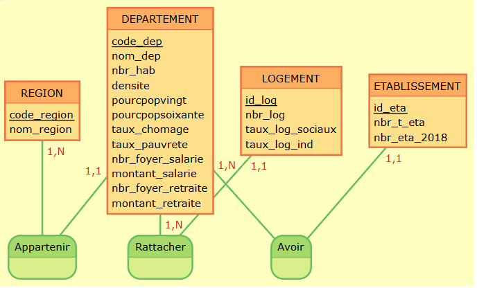{#MCD width="8cm" height="4cm"}
- A partir de ce modèle conceptuel(MCD), nous avons crée la version manuscrite de notre
Modèle Organisationnel de Données(MOD):
\medskip

DEPARTEMENT (code_dep, nom_dep, nbr_hab, densite, pourcpopvingt, pourcpopsoixante, taux_chomage, taux_pauvrete,nbr_foyer_salarie, montant_salarie, nbr_foyer_retraite, montant_retraite, code_region)

\medskip

REGION (code_region, nom_region)

\medskip

LOGEMENT (id_log, nbr_log, taux_log_sociaux, taux_log_ind, code_dep)

\medskip

ETABLISSEMENT (id_eta, nbr_t_eta, nbr_eta_2018, code_dep)

\medskip

Pour le MOD, on inclut une image réalisée avec le designer de phpmyadmin, visible sur la Figure$~$\ref{MOD} ci-dessous :

  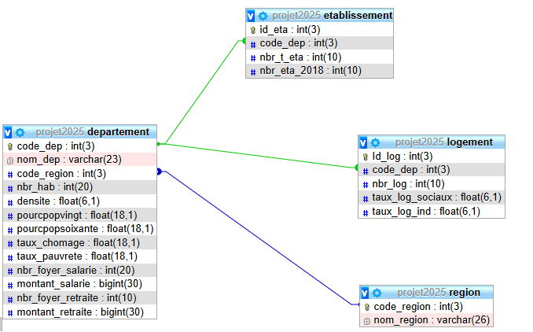{#MOD width="10cm" height="7cm"}


\bigskip


## Import des données 

Avant de procéder avec l’importation des données dans PhpMyAdmin, on a effectué un nettoyage des données.
\bigskip

**Source de données 1**: Nous avons choisi de nous concentrer uniquement sur les revenus des individus, en distinguant les salariés des retraités. Toutes les colonnes liées aux impôts et aux autres données fiscales ont été supprimées, car elles ne relevaient pas de notre champ d’analyse. Nous avons conservé et renommé uniquement les colonnes décrivant le département (nom et numéro), ainsi que celles indiquant le montant des revenus pour les salariés et les retraités.
 
 
\medskip

Nous avons filtré la colonne « année » afin de ne conserver que les données de l’année 2018. Pour la colonne « code_dep », nous avons supprimé tous les numéros de département précédés d’un zéro et se terminant par un zéro, à l’aide d’une fonction Excel. Par ailleurs, nous avons remplacé les codes des départements de la Corse-du-Sud (2A) et de la Haute-Corse (2B) par les valeurs 96 et 97,afin d’avoir tous les codes de départements en entier.
Concernant les colonnes retenues, nous avons nettoyé l’ensemble des données en supprimant les accents, les caractères spéciaux et les majuscules. Nous avons également simplifié les intitulés des en-têtes de colonnes. Pour cela, nous avons utilisé la fonction SUBSTITUTE d’Excel, qui nous a aussi permis de retirer les espaces entre les chiffres dans les colonnes relatives au nombre de foyers et aux montants, afin d’assurer une importation correcte des données au format entier dans MAMP

\bigskip
**Source de données 2** : Pour cette étude, nous avons retenu les colonnes relatives au département, à la région d’appartenance, aux données sur les logements (nombre total de logement, part de logements sociaux et individuels), ainsi qu’à divers indicateurs socio-économiques : taux de chômage, taux de pauvreté, densité de population, pourcentage de la population de moins de 20 ans et de 60 ans et plus.
 
\medskip
Nous avons trié les départements par ordre alphabétique croissant afin de faciliter la combinaison des deux jeux de données et de créer une seule table intitulée « Departement » dans MAMP. Par ailleurs, le département de Mayotte a été supprimé car il ne figurait pas dans le second jeu de données et les informations le concernant étaient incomplètes. Les colonnes retenues ont ensuite été renommées comme suit : **code_dep, nom_dep, nbr_foyer_salarie, montant_salarie, nbr_foyer_retraite, montant_retraite,code_region, nom_region, nbr_hab, densite,pourcpopvingt,pourcpopsoixante, taux_chomage, taux_pauvrete, nbr_log, taux_log_sociaux, taux_log_individuel**.

\bigskip


**Source de données 3** : Pour ce jeu de données, nous avons choisi d’exclure la colonne relative à la part des établissements culturels construits en 2018, l’unité de mesure n’étant pas clairement spécifiée. Il n’était pas possible de déterminer s’il s’agissait d’une valeur monétaire (en euros, milliers ou millions) ce qui aurait pu fausser l’interprétation.
Les colonnes retenues ont été renommées comme suit: **id_eta, code_dep, nbr_t_eta, nbr_eta_2018**.


\bigskip


## Requêtes réalisées
```{r echo=FALSE}

#install.packages("RMySQL")
#install.packages("DBI")
library(DBI)
con <- DBI::dbConnect(
  drv = RMySQL::MySQL(),    
  host = "localhost", 
  port = 3306, 
  username = "root", 
  password = "root",  
  dbname = "projet2025"   
)
```


**Requête 1**: Lister tous les départements avec leur nom, le nombre d’habitants et le taux de pauvreté
```{sql connection = con}
SELECT departement.nom_dep,departement.nbr_hab ,departement.taux_pauvrete
from departement

```
\medskip

**Requête 2**: Lister les départements dont nom contient le mot « loire »
```{sql connection = con}
SELECT departement.code_dep, departement.nom_dep
from departement
where departement.nom_dep LIKE "%loire%"

```


\medskip

**Requête 3**: Lister les départements  avec leur densité qui  possèdent un taux de pauvreté inférieur à  la moyenne. On affichera les dix premiers départements qui enregistrent le moins de chômage 
```{sql connection = con}
SELECT code_dep,nom_dep, densite, taux_pauvrete
FROM departement
WHERE taux_pauvrete < (SELECT AVG(taux_pauvrete) FROM departement)
ORDER BY taux_pauvrete 
LIMIT 10;


```

\medskip

**Requête 4** : Lister les départements avec leur densité qui possèdent un taux de chômage inférieur à la moyenne. On affichera les dix premiers départements qui enregistrent le moins de chômage
```{sql connection = con}
SELECT code_dep,nom_dep, densite, taux_chomage
FROM departement
WHERE taux_chomage < (SELECT AVG(taux_chomage) FROM departement)
ORDER BY taux_chomage
LIMIT 10;

```

\medskip
Les requêtes 3 et 4 fournissent  des éléments sur la situation économique des départements, notamment à travers les taux de chômage et de pauvreté. Bien que ces indicateurs soient importants, ils ne suffisent pas à eux seuls à déterminer dans quels départements l’on vit le mieux. Les résultats montrent que les départements ayant les taux de chômage les plus faibles ne sont pas nécessairement ceux où la pauvreté est la moins présente. Certains départements, comme la Côte-d'Or, la Haute-Savoie et l’Ain, présentent toutefois des taux faibles pour ces deux indicateurs.

L’information relative à la densité de population permet également d’apprécier si ces départements sont fortement peuplés ou non. On observe que, mis à part Hauts-Savoie et Yvelines, les départements concernés sont peu ou moyennement peuplés.

\medskip
**Requête 5** : Lister les dix départements français qui présentent la densité de population la plus élevée.
```{sql connection = con}
SELECT departement.code_dep,departement.nom_dep,departement.densite
FROM departement
ORDER BY departement.densite DESC
LIMIT 10;
```


\medskip

**Requête 6** : Lister départements avec le montant des revenues des salariés par ordre décroissant.
```{sql connection = con}
SELECT departement.code_dep,departement.nom_dep,departement.montant_salarie
FROM departement
ORDER BY departement.montant_salarie DESC

```
\medskip

**Requête 7** : Lister les dix départements  les plus peuplés et le revenu des salariés correspondant .On donnera aussi le nombre de logements de ces départements
```{sql connection = con}
SELECT d.nom_dep, d.nbr_hab, d.montant_salarie, l.nbr_log
FROM departement d
JOIN logement l ON d.code_dep = l.code_dep
ORDER BY d.nbr_hab DESC
LIMIT 10;

```

\medskip
L’objectif de cette requête est d’examiner si les départements les plus peuplés c’est-à-dire avec le plus grand nombre d'habitants présentent également un revenu moyen plus élevé ainsi qu’une proportion plus importante de logements que les autres.

Les résultats montrent que le nombre d’habitants n’est pas nécessairement proportionnel au revenu moyen des salariés ni au nombre de logements par département. Par exemple, le département du Nord est plus peuplé que Paris, mais cette dernière compte davantage de logements et affiche un revenu moyen des salariés plus élevé.

\medskip
**Requête 8** : Lister les départements qui possèdent le plus d’établissements culturels 
```{sql connection = con}
SELECT d.code_dep, d.nom_dep, e.nbr_t_eta
FROM departement d, etablissement e
WHERE d.code_dep=e.code_dep
ORDER BY nbr_t_eta DESC
LIMIT 10;
```

\medskip
Avec cette requête et  la 5, on a pu observer que les départements ayant le plus grand nombre d’établissements sont, pour la plupart, ceux ayant la densité la plus élevée.

\medskip

**Requête 9**: Afficher le nombre d’établissement total par region et le nom de la region
```{sql connection = con}
SELECT r.nom_region, SUM(e.nbr_t_eta) AS total_etablissements
FROM region r
JOIN departement d ON r.code_region = d.code_region
JOIN etablissement e ON d.code_dep = e.code_dep
GROUP BY r.nom_region
ORDER BY total_etablissements DESC;

```

\medskip
Cette requête donne une vision globale de l'offre d'infrastructures dans chaque région, ce qui peut être un critère de qualité de vie. Les régions avec plus d’établissements culturels peuvent offrir des conditions de vie plus favorables en termes d’accès à la culture.

Nous pouvons observer que la région Île-de-France regroupe les départements les plus peuplés en termes de densité, ce qui en fait la région avec le plus grand nombre d'infrastructures culturelles.

\medskip

**Requête 10** : Lister dix départements avec les taux de logements sociaux les plus faibles et les revenus des salariés correspondants 
```{sql connection = con}
SELECT d.code_dep,d.nom_dep, l.taux_log_sociaux ,d.montant_salarie
FROM departement d
JOIN logement l ON d.code_dep = l.code_dep
ORDER BY l.taux_log_sociaux ASC
LIMIT 10;
```
\medskip
Cette requête nous permet de voir que les départements présentant les taux de logements sociaux les plus faibles ne sont pas forcément ceux ayant les revenus les plus élevés, comme on pourrait le croire. Au contraire, par exemple, des départements comme la Lozère, l'Ariège et le Lot sont des départements ayant à la fois les revenus salariaux les plus bas et les taux de logements sociaux les plus faibles.


# Matériel et Méthodes

## Logiciels


Pour faciliter les échanges tout au long du projet, nous avons utilisé le logiciel Google Docs avec un dossier partagé, dans lequel chacune avançait sur sa partie.

\medskip

Pour travailler et communiquer en temps réel, nous avons également utilisé l’application WhatsApp ainsi que les adresses mail de l’université afin de nous transmettre, à tour de rôle, chaque nouvelle modification apportée.

\medskip

Le logiciel Excel nous a permis de supprimer les colonnes inutiles, de nettoyer les données comme évoqué dans la partie sur l’importation des données  et de créer différentes feuilles correspondant aux tables.

\medskip
Grâce à l'outil open-source MOCODO, nous avons pu créer le Modèle Conceptuel de Données(MCD). Et ensuite avec l’application MAMP, via l’interface PhpMyAdmin, nous avons créer le Modèle Organisationnel de Données (MOD) et manipuler nos données pour réaliser les requêtes nécessaires.

\medskip

Nous avons ensuite utilisé le logiciel R, à travers son interface RStudio, pour effectuer des analyses statistiques, produire des graphiques, établir une connexion directe avec notre base de données, et générer un rapport complet au format PDF à l’aide de R Markdown.

\medskip

Enfin, nous avons eu recours à l'outil d'intelligence artificielle générative ChatGPT pour la correction orthographique ainsi que pour l'amélioration rédactionnelle de l’ensemble du rapport.Tout en précisant qu'on ne lui a pas demandé de nous générer directement du texte, ce sont nos propres textes qu’il a juste corrigé.

\medskip

Les analyses ont été réalisées sur un ordinateur fonctionnant sous Windows 11, équipé d'un processeur Intel Core i7-1065G7 cadencé à 1,30 GHz, de 32 Go de mémoire vive, d'un stockage de 512 Go et d'une carte graphique Intel Iris Plus Graphics.
 


## Modélisation statistique


Pour les analyses des relations entre nos variables nous avons utilisé le logiciel R Markdown.

\medskip

Nous avons utilisé deux outils fondamentaux: le test de corrélation de Pearson et l’analyse de variance (ANOVA).

\bigskip

### Le test de corrélation de Pearson
Ce test évalue l’intensité et le signe d’une relation linéaire entre deux variables quantitatives. 
\medskip

Pour son utilisation dans R on a utilisé la fonction cor() pour le simple calcul  et cor.test() pour effectuer le test de corrélation. 
\medskip

\begin{center} 

$$
r =\frac {{Cov}(X,Y)} {\sigma(X) \cdot \sigma (Y)}
$$

\end{center}
\medskip

### Analyse de la variance
L’ANOVA est utilisé pour comparer les moyennes de plusieurs groupes et se base sur la décomposition de la variance totale en ses deux composantes: la variance INTER et la variance INTRA.
\medskip

La statistique de test pour le test d’ANOVA peut s’écrire:

$$
\frac {INTER} {INTRA}  (n-K)
$$
$n=$ effectifs et $K=$ nombre de groupes

\medskip
Pour effectuer le test d’ANOVA sur R on a utilisé la fonction aov(). 

\bigskip

# Analyse Exploratoire des Données
 
Après avoir importé les fichiers ( Departement.csv, Etablissement.csv, Logement.csv ) contenant nos données, on a pu coder les types des variables de notre jeu de données ( codes en annexe).
Avec ceci on a créé des data frames pour mieux traiter les données.

\bigskip

## Import des fichiers csv utiles aux analyses statistiques

```{r,echo= FALSE}
library(ggplot2)

departement <- read.csv("Departement.csv", header = T)
departement <- as.data.frame(departement)

attach(departement)

#head(departement)

#variables qualitatives nominales 

departement$code_dep <- as.factor(departement$code_dep)
#dans ce cas la variable code_dep est une variable qualitative nominale, 
#même chose pour code_region
departement$nom_dep <- as.factor(departement$nom_dep)
departement$code_region <- as.factor(departement$code_region)

#variables quantitatives discrètes

departement$nbr_hab <- as.integer(departement$nbr_hab)
departement$nbr_foyer_salarie <- as.integer(departement$nbr_foyer_salarie)
departement$nbr_foyer_retraite <- as.integer(departement$nbr_foyer_retraite)

#variables quantitatives continues 
#departement$densité <- as.double(departement$densité)

departement$pourcpopvingt <- as.double(departement$pourcpopvingt)
departement$pourpopsoixante <- as.double(departement$pourpopsoixante)
departement$taux_chomage <- as.double(departement$taux_chomage)
departement$taux_pauvrete <- as.double(departement$taux_pauvrete)
departement$montant_salarie <- as.double(departement$montant_salarie)
departement$montant_retraite <-as.double(departement$montant_retraite)

```


```{r,echo= FALSE}
library(ggplot2)

etablissement <- read.csv("Etablissement.csv", header = T)
etablissement <- as.data.frame(etablissement)

attach(etablissement)

#variables qualitatives nominales

etablissement$id_eta <- as.factor(etablissement$id_eta)
etablissement$code_dep <- as.factor(etablissement$code_dep)

#variables quantitatives discrètes

etablissement$nbr_t_eta <- as.integer(etablissement$nbr_t_eta)
etablissement$nbr_eta_2018 <- as.integer(etablissement$nbr_eta_2018)
```
Voici la nature des variables utilisées:

\medskip

- montant_salarie : variable quantitative continue

\medskip

- taux_chomage : variable quantitative continue

\medskip

- taux_chomage : variable quantitative continue

\medskip

- taux_log_sociax : variable quantitative continue

\medskip

- nbr_t_eta : variable quantitative discrète

\bigskip


```{r,echo= FALSE}
library(ggplot2)

logement <- read.csv("Logement.csv", header = T)
logement <- as.data.frame(logement)

attach(logement)

#variables qualitatives nominales

logement$Id_log <- as.factor(logement$Id_log)
logement$code_dep <- as.factor(logement$code_dep)

#variables quantitatives discrètes

logement$nbr_log <- as.integer(logement$nbr_log)

#variables quantitatives continues

logement$t_log_soc <- as.double(logement$t_log_soc)
logement$t_log_indiv <- as.double(logement$t_log_indiv)
```


## Analyses univariées

On considère d’abord la variable **nombre d’habitants par départements**. Pour mieux la visualiser la représente à l’aide d’un histogramme.

```{r, out.width= "12cm", fig.align= "center",echo= FALSE}
ggplot(departement, aes(x = nbr_hab)) +
  geom_histogram(fill = "salmon", color = "white") +
  labs(title = "Histogramme du nombre d'habitants", x = "Habitants", y = "Effectif") +
  theme_minimal()

```

\normalsize
On remarque une grande disparité dans la répartition du nombre d'habitants par département, comme on peut le voir avec certains départements très peuplés et d'autres n'enregistrant que peu d'habitants.

\medskip

On calcule la moyenne globale:
\medskip

```{r,echo= FALSE}
mean(departement$nbr_hab)
```
\medskip

On calcule la mediane globale:
```{r,echo= FALSE}
median(departement$nbr_hab)
```
\bigskip

Maintenant on va considérer la variable **nombre de logements par départements**. Comme pour la variable précédente on va la représenter grâce à un histogramme.
\medskip

```{r, out.width= "12cm", fig.align= "center",echo= FALSE}
ggplot(logement, aes(x = nbr_log)) +
  geom_histogram(fill = "orchid", color = "white") +
  labs(title = "Histogramme du nombre de logements", x = "Logements", y = "Effectif") +
  theme_minimal()

```
\medskip

On constate une grande disparité dans la répartition du nombre de logements par département, comme on peut le voir avec certains départements ayant de nombreux logements et d'autres n'enregistrant que peu de logements.


\bigskip

Selon notre hypothèse, les disparités importantes pourraient être dû au fait qu'un département plus peuplé ait plus de logements qu'un département moins peuplé. On va vérifier cela dans la partie suivante de l’analyse bivariée.

\bigskip

## Analyses bivariées
On commence par analyser la relation entre les **variables montant salaire et le taux de chômage**.
Afin de mieux visualiser un lien éventuel entre les variables, on représente le nuage de points des variables montant_salaire et taux_chomage:
\medskip 

```{r, out.width= "12cm", fig.align= "center",echo=FALSE}
#revenu et taux chomage
data<- departement

library(ggplot2)

nuage1<-ggplot(data, aes(x = montant_salarie, y = taux_chomage)) + 

  geom_point(color="lightblue",size=2) +  
 
  labs(x = "Montant salaires", y = "Taux de chômage", title = "Relation entre salaire et chômage par departement") +
 
  theme_minimal()+
  
  theme(axis.title.y = element_text(margin = margin(r = 20),size=10),
        axis.title.x = element_text(margin = margin(t=20),size=10),
        legend.position = "none",
        axis.text.y = element_text( size = 8),
        axis.text.x = element_text( size = 8),
        #plot.background = element_rect(color = "grey", fill = NA, size = 1),
        #plot.margin = margin(t = 20, r = 20, b = 20, l = 20, unit = "pt")
        ) 
nuage1

```
\medskip 

On observe un nuage de points très dispersé, avec cinq points particulièrement éloignés des autres. Il ne semble pas y avoir de lien entre le montant des salaires générés par département et le taux de chômage. 
\medskip 

A partir du nuage de points on peut supposer que entre les deux variables il n'y a pas de liaison, on calcule donc le coefficient de corrélation:
\medskip 

Après le calcul on obtient le coefficient de corrélation:

\medskip 

```{r,echo=FALSE}
cor(departement$montant_salarie, departement$taux_chomage, method="pearson")
```
\medskip

Ce résultat montre une corrélation inverse faible entre les deux variables. 
Pour approfondir notre analyse, on passe au test de corrélation entre les deux variables.

\medskip

**Hypothèse H**: les variables montant_salaire et taux_chomage ne sont pas corrélées
On procède avec le test à l’aide de la fonction cor.test sur R, qui nous fournit tous les détailles:

\medskip
```{r,echo=FALSE}
cor.test(departement$montant_salarie, departement$taux_chomage, method="pearson")
```
\medskip

Le résultat nous indique une relation linéaire non significative entre les variables montant salaire et taux chômage avec un coefficient de corrélation r = -0.10.

\medskip

La co-valeure 0.3177 est inférieure à 0.05, cela implique qu' avec un niveau de confiance de 95%, on ne peut rejeter l'hypothèse H.

\medskip

Il n'existe donc aucune association linéaire significative entre le montant des salaires par département et le taux de chômage. On en déduit que les salaires n’ont pas d’influence sur le taux de chômage.

\bigskip

Il est aussi intéressant de voir si les variables **montant_salaire et taux_pauvrete** sont corrélées. Voici le nuage des points des deux variables:

```{r, out.width= "12cm", fig.align= "center",echo=FALSE}
#revenu et taux pauvrete
data<- departement

nuage1<-ggplot(data, aes(x = montant_salarie, y = taux_pauvrete)) + 

  geom_point(color="coral4",size=2) +  
 
  labs(x = "Montant salaires", y = "Taux de pauvreté", title = "Relation entre salaire et pauvreté par departement") +
 
  theme_minimal()+
  
  theme(axis.title.y = element_text(margin = margin(r = 20),size=10),
        axis.title.x = element_text(margin = margin(t=20),size=10),
        legend.position = "none",
        axis.text.y = element_text( size = 8),
        axis.text.x = element_text( size = 8),
        #plot.background = element_rect(color = "grey", fill = NA, size = 1),
        #plot.margin = margin(t = 20, r = 20, b = 20, l = 20, unit = "pt")
        ) 
nuage1

```

\medskip
On observe un nuage de points un peu plus condensé, avec également cinq points qui restent quelque peu isolés par rapport aux autres.

\medskip

A partir du nuage des points il semble qu’il n’y ait pas de lien entre le montant des salaires générés par département et le taux de pauvreté dans ces départements.

\medskip

On calcule donc le coefficient de corrélation:

\medskip
```{r,,echo=FALSE}
cor(departement$montant_salarie, departement$taux_pauvrete, method="pearson")
```
\medskip

Ce résultat montre une corrélation inverse très faible entre les deux variables. 

\medskip

Comme avant on procède au test de corrélation entre ces variables:

\medskip

**Hypothèse H**: les variables montant_salaire et taux_pauvrete ne sont pas corrélés.

\medskip

Voici les résultats du test en détail:

\medskip
```{r,echo=FALSE}
cor.test(departement$montant_salarie, departement$taux_pauvrete, method="pearson")
```
\medskip
On a bien confirmé que il y a une relation linéaire non significative entre les variables montant_salaire et taux_pauvrete, avec un coefficient de corrélation r=-0.015
\medskip

La p-valeure de 0.8793 est largement supérieure à 0.05, cela implique qu'avec un niveau de confiance de 95%, on ne peut pas rejeter l'hypothèse H.
\medskip

Il n'existe donc aucune association linéaire significative entre le montant des salaires par département et le taux de pauvreté. On en déduit que les salaires n’ont pas d’influence sur le taux de pauvreté.

\bigskip
On passe finalement à l’analyse des relations entre les variables **nbr_t_eta et t_log_soc**:
Voici le nuage des points:
\medskip
```{r, out.width= "12cm", fig.align= "center",echo=FALSE}
#établissement et logements sociaux 
data<- etablissement
data<- logement

nuage1<-ggplot(data, aes(x = nbr_t_eta, y = t_log_soc)) + 

  geom_point(color="violetred",size=2) +  
 
  labs(x = "établissements culturels", y = "taux de logements sociaux", title = "Relation entre les établissements culturels et les logemens sociaux") +
 
  theme_minimal()+
  
  theme(axis.title.y = element_text(margin = margin(r = 20),size=10),
        axis.title.x = element_text(margin = margin(t=20),size=10),
        legend.position = "none",
        axis.text.y = element_text( size = 8),
        axis.text.x = element_text( size = 8),
        #plot.background = element_rect(color = "grey", fill = NA, size = 1),
        #plot.margin = margin(t = 20, r = 20, b = 20, l = 20, unit = "pt")
        ) 
nuage1

```
\medskip


On observe un nuage de points légèrement éparpillé, avec un point atypique particulièrement éloigné des autres. On pourrait supposer l’existence d’un lien positif faible entre les deux variables. Toutefois, il est également possible qu’il n’existe aucun lien entre le nombre d’établissements culturels et le taux de logements sociaux dans un département.

\medskip

Pour  vérifier cela on calcule le coefficient de corrélation:

\medskip
```{r,echo=FALSE}
cor(etablissement$nbr_t_eta, logement$t_log_soc, method="pearson")
```
\medskip

Le résultat nous montre une corrélation faible positive entre les deux variables.

\medskip

On passe au test de corrélation pour mieux analyser ce lien.

\medskip

**Hypothèse H**: les variables nombre d'établissements culturels et taux de logements sociaux ne sont pas corrélées.

\medskip

On procède avec le test avec la fonction cor.test pour plus de détails:

\medskip

```{r,echo=FALSE}
cor.test(etablissement$nbr_t_eta, logement$t_log_soc, method="pearson")
```
\medskip

Le résultat nous suggère une relation linéaire positive entre  entre les variables nombre d’établissements culturels et taux de logements sociaux, avec un coefficient de corrélation r = 0.31.

\medskip

La p-valeur de 0.0018 est bien inférieure à 0.05, ce qui implique qu’avec un niveau de confiance de 95%, on peut rejeter l’hypothèse H et conclure qu’il existe une corrélation significative entre les deux variables.

\medskip

Il existe donc une association linéaire positive entre le nombre d’établissements culturels et le taux de logements sociaux par département. Les résultats suggèrent que les départements ayant davantage d’établissements culturels tendent également à avoir un taux de logements sociaux plus élevé.

\bigskip

## Test d'ANOVA

Nous souhaitons étudier si le revenu par classe a un effet significatif sur le nombre d'établissements culturels par département. Pour cela nous avons réalisé un test d’ANOVA (analyse de variance à un facteur).

\medskip

Les données concernant la variable montant_salaire ont été classées en quatre catégories (selon les quartiles) afin de les transformer en une variable qualitative ordinale catégorie de revenu avec 4 modalités: **faible, moyen-faible, moyen-élevé et élevé**.

\medskip

L’objectif de cette analyse est de déterminer si le niveau de revenu d’un département (catégorie de revenu) a un impact significatif sur le nombre d'établissements culturels présents sur son territoire.

\medskip

Nous utilisons donc un test d’ANOVA à un facteur pour répondre à cette question. 

\medskip

**Hypothèse**: Les revenus par classe n'ont pas d'impact sur la distribution du nombre total d'établissements culturels dans chaque département.

\medskip

Nous avons appliqué le test d’ANOVA pour comparer les moyennes du nombre d'établissements culturels entre ces groupes:

\bigskip


```{r ,fig.align= "center",echo=FALSE}
donnees_fusionnees <- merge(departement, etablissement, by = "code_dep")

# Division en quartiles pour créer 4 catégories de revenu
donnees_fusionnees$categorie_revenu <- cut(donnees_fusionnees$montant_salarie, 
                                     breaks = quantile(donnees_fusionnees$montant_salarie, 
                                                      probs = seq(0, 1, 0.25), 
                                                      na.rm = TRUE),
                                     labels = c("Faible", "Moyen-Faible", "Moyen-Élevé", "Élevé"),
                                     include.lowest = TRUE)

anova <- aov(nbr_t_eta ~ categorie_revenu, data = donnees_fusionnees)

summary(anova)

```
\medskip

La statistique de test F est calculée comme le rapport de la variance inter-groupes a la variance intra-groupes. ici F=234.4 qui indique une variabilité entre groupes supérieure à celle à l'intérieur des groupes. En plus la p-valeur associée est extrêmement faible ($1.17 × 10^-{15}$), bien inférieure au seuil de 0.05.

\medskip

Puisque la p-valeur est très inférieure à 0.05, on rejette l'hypothèse. 
On peut donc dire qu’il existe une difference tres significative du nombre moyen d'établissement culturels selon la catégorie de revenu.

\medskip

Le revenu a donc un effet et sur le nombre d'établissements culturels.

\bigskip

Visualisons avec un box-plot le nombre d'établissements culturels par catégorie de revenu.

```{r, fig.cap = "Nombre d'établissements culturels par catégorie de revenu",out.width= "12cm", fig.align= "center",echo=FALSE}
#visualisation avec boxplot

library(ggplot2)
ggplot(donnees_fusionnees, aes(x = categorie_revenu, y = nbr_t_eta, fill = categorie_revenu)) +
  geom_boxplot() +
  labs(title = "Nombre d'établissements culturels par catégorie de revenu",
       x = "Catégorie de revenu",
       y = "Nombre d'établissements culturels") +
  theme_minimal() +
  theme(legend.position = "none")


```

\medskip

Le boxplot du nombre d'établissements culturels par catégorie de revenu montre visuellement que:
le nombre d'établissements augmente nettement avec la catégorie de revenu.

\medskip

La médiane et la dispersion sont plus élevées dans les groupes à revenu élevé.

\bigskip

En conclusion, le test d’ANOVA montre que **le revenu moyen d’un département à un effet significatif sur le nombre d'établissements culturels**.

# Discussion

Notre analyse a relevé une absence de corrélation significative entre le montant des salaires et le taux de chômage, ainsi qu’entre le montant des salaires et le taux de pauvreté. Ces résultats contredisent l'hypothèse selon laquelle les départements aux revenus plus élevés offraient nécessairement de meilleures conditions de vie. En effet, certains départements comme Paris ou les Hauts-de-Seine présentent des revenus parmi les plus élevés, mais cela ne se traduit pas automatiquement par des taux de chômage ou de pauvreté plus faibles.

\medskip

L’absence de corrélation suggère que d’autres facteurs influencent la qualité de vie dans les départements. Par exemple, le coût de la vie ou le prix de l’immobilier,etc.

\medskip

En revanche, le test d’ANOVA  a démontré une relation significative entre le niveau de revenu d’un département et le nombre d'établissements culturels. Le boxplot illustre clairement que les départements à revenus élevés disposent en moyenne davantage d'établissements culturels. Cette partie de notre hypothèse initiale se trouve donc confirmée: les départements économiquement plus favorisés offrent effectivement un accès plus important à la culture.

\medskip

Cependant cette relation mérite d'être nuancée.La présence d'infrastructures culturelles pourrait être davantage liée à la densité de la population qu’au revenu en lui- même.
Nos requêtes SQL ont montré que les départements avec le plus d'établissements culturels correspondent en grand partie à ceux ayant les densités de population les plus élevées. 

\medskip

Contrairement à notre hypothèse initiale, l’analyse montre une corrélation positive significative entre le nombre d'établissements culturels et le taux de logements sociaux. Ainsi les départements disposant de nombreuses infrastructures culturelles tendent également à avoir une proportion plus importante de logements sociaux, ce qui va à l'encontre de l'idée que les départements offrant les meilleures conditions de vie auraient moins de logements sociaux.

\bigskip


# Conclusion {.label:ccl}

Cette étude a permis d'explorer la question des meilleures conditions de vie dans les départements français, en les liant à des critères tels que les revenus moyens, l'accès aux infrastructures culturelles, et la proportion de logements sociaux. Les résultats ont remis en cause l'idée selon laquelle les départements avec les revenus les plus élevés sont automatiquement ceux offrant les meilleures conditions de vie.
\medskip
Des départements comme la Haute-Savoie, la Vendée, et les Yvelines illustrent que des faibles taux de pauvreté et un accès à des infrastructures culturelles variées peuvent contribuer à des conditions de vie de qualité, même si leurs revenus ne sont pas toujours les plus élevés. À l'inverse, des départements comme Paris ou les Hauts-de-Seine, bien que riches, ne garantissent pas nécessairement des conditions de vie plus favorables, notamment à cause des inégalités sociales et de l'accès limité à certains services publics.
\medskip
Les résultats ont également montré que les départements à faibles taux de chômage, tels que l’Ain, l’Aveyron, ou le Calvados, bien qu’économiquement moins dynamiques, peuvent offrir une qualité de vie comparable à celle de départements plus riches. Cela suggère que des facteurs sociaux et culturels, comme l'accès à la culture et à des logements sociaux, jouent un rôle tout aussi important que le revenu dans la définition des conditions de vie.
\medskip
En conclusion, cette étude met en lumière l’importance d’une approche multidimensionnelle pour évaluer les conditions de vie dans les départements français. Il est clair que les revenus ne sont pas le seul facteur déterminant. Des départements avec un revenu moyen plus bas peuvent offrir une meilleure qualité de vie grâce à une gestion plus équilibrée de l'accès au logement, à la culture et à la réduction des inégalités sociales. Pour évaluer réellement les conditions de vie, il est nécessaire de prendre en compte l'ensemble de ces facteurs, et non de se concentrer uniquement sur les indicateurs économiques.
\bigskip

## Perspectives 

Pour améliorer rapidement notre approche de l’évaluation de la qualité de vie, il serait judicieux d’élargir le nombre d’indicateurs utilisés. En complément du revenu moyen, du taux de  logements sociaux, d’établissements culturels,  du taux de pauvreté, du taux de chômage l’intégration de facteurs comme l’espérance de vie, le taux de criminalité, la qualité de l’air, le coût de la vie et le prix de l’immobilier permettrait d'obtenir une vision plus complète et précise des conditions de vie dans les départements français.

\bigskip

À plus long terme, il serait intéressant de construire un indice composite de qualité de vie basé sur une pondération de différents critères sociaux, économiques et environnementaux. D’un point de vue "science des données", cela pourrait impliquer l’utilisation de techniques de machine learning non supervisées (ex : clustering) pour identifier naturellement des groupes de départements ayant des profils de qualité de vie similaires et  des critères spécifiques aux demandeurs pour identifier le département le plus adéquat à leur attente. Enfin cette analyse  pourrait être utilisée pour guider les politiques publiques d’aménagement du territoire, en ciblant mieux les investissements dans les infrastructures sociales, culturelles et environnementales.

## Difficultés 

Nous avons rencontré quelques difficultés notamment lors de l’importation des données dans PhpMyAdmin, nous avons rencontré de nombreuses erreurs. Il a été nécessaire d’effectuer plusieurs modifications dans Excel : suppression des accents, réduction du nombre de décimales après la virgule et suppression des espaces entre les chiffres afin d’éviter leur interprétation comme des chaînes de caractères. Malgré ces ajustements, certaines erreurs persistaient sans explication claire pour certaines d’entre nous , tandis que d'autres tables s'importaient correctement chez d’autres.

\medskip

Nous avons également été confrontées à un problème de correspondance des années entre nos différentes sources de données. La première source de  données sur les revenus couvraient la période 2000-2017, tandis que la deuxième source de données sur leslogements et  logements sociaux  concernaient les années 2018-2023.
 Pour assurer la cohérence de la table **Departement**, nous avons retenu, pour chaque source de donné, la dernière année disponible. L'analyse des évolutions d’une année sur l’autre a montré des écarts faibles, ce qui nous a permis d’estimer que les données de 2017 et 2018 étaient suffisamment proches pour être combinées.


# Bibliographie {-}

<div id="refs"></div>

https://biostatisticien.eu/springeR/livreR.pdf

\medskip

https://www.scribbr.com/statistics/anova-in-r/

\medskip

https://louernos-nature.fr/test-correlation-statistique-langage-r/perplexity.ai


# Annexes {-}

```{r, out.width= "12cm", fig.align= "center", echo=FALSE}

#install.packages(c("sf", "ggplot2", "dplyr"))
library(sf)
library(ggplot2)
library(dplyr)

departement <- st_read("https://raw.githubusercontent.com/codeforamerica/click_that_hood/master/public/data/france-departments.geojson")

set.seed(42)
departement$montant_sa <- sample(50000000:30000000000, nrow(departement), replace = TRUE)

ggplot(departement) +
  geom_sf(aes(fill = montant_sa)) +
  scale_fill_viridis_c(option = "plasma", trans = "log", name = "Montant salaire") +
  labs(
    title = "Montant salaire par département en France"
  ) +
  theme_minimal() +
  theme(legend.position = "right")


```


## **Codes** {-}


 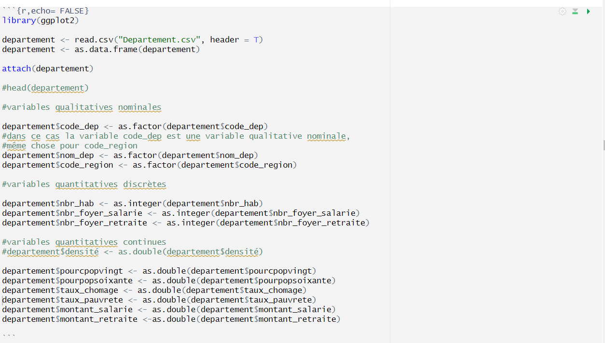{#Nature width="15cm" height="10cm"}
 
 \medskip 
 
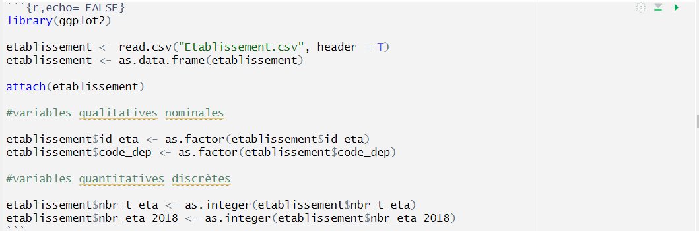{#Nature  width="15cm" height="9cm"}

 
 \medskip 
 

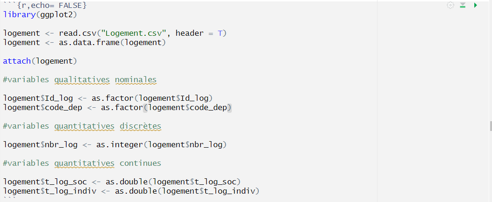{#Nature  width="15cm" height="9cm"}

 
 \medskip 


{#Histogramme width="15cm" height="2cm"}

\medskip


{#Histogramme2 width="15cm" height="2cm"}

\medskip


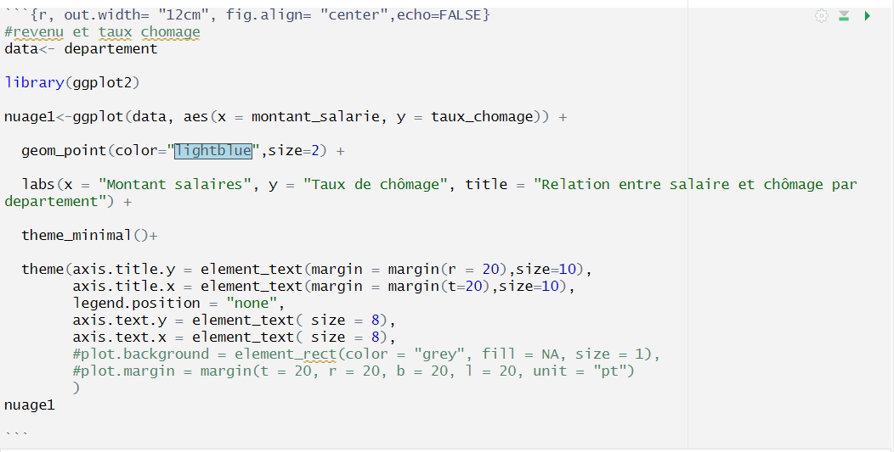{#Nuage width="15cm" height="9cm"}

\medskip

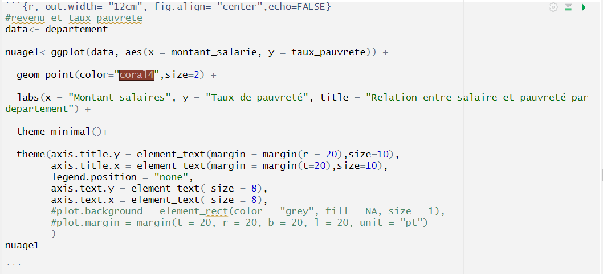{#Nuage width="15cm" height="9cm"}

\medskip

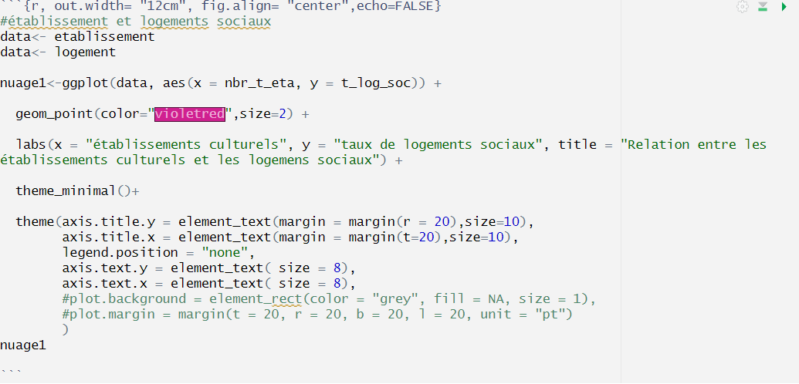{#Nuage width="15cm" height="9cm"}


\medskip

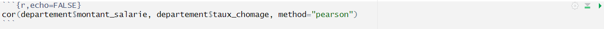{#Correlation width="15cm" height="1cm"}

\medskip

{#Test_corr width="15cm" height="1cm"}

\medskip

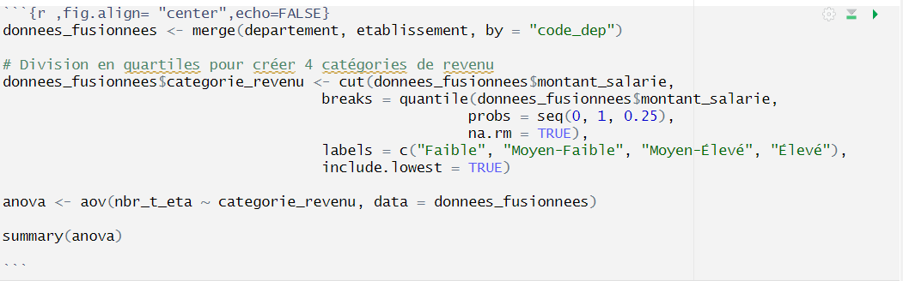{#ANOVA width="15cm" height="5cm"}

\medskip

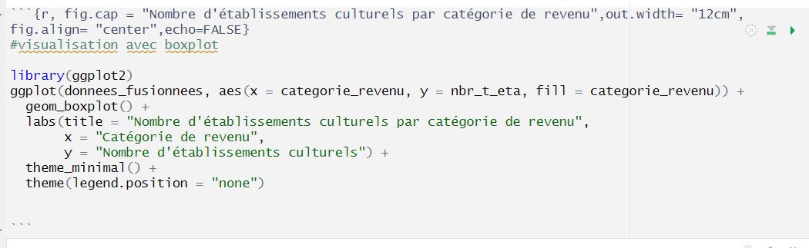{#Box_plot width="15cm" height="5cm"}


